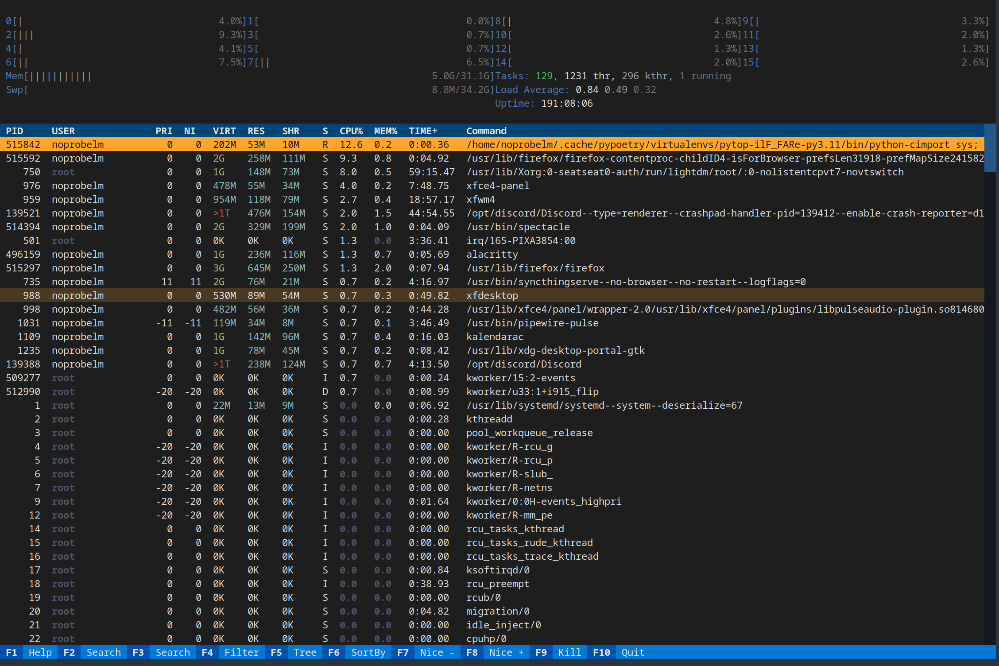

# Pytop

`Pytop` is a system resource monitoring utility modeled after [htop](https://github.com/htop-dev/htop). This project is currently under development with many features pending implementation.

## Screenshots

